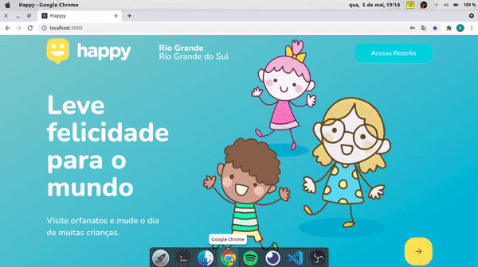

# Happy 2.0

## Índice
  1. [Descrição](#description)
  2. [Tecnologias](#techs)
  3. [Rotas](#rotes)
  4. [Como Rodar](#run)
  
 

 
## Descrição

Sistema para ajudar a conectar orfanatos a possiveis visitantes. Adicionada área de administrador, possibilitando controlar os orfanatos adicionados pelo público.

## Tecnologias

[React](https://pt-br.reactjs.org/)

[Node](https://nodejs.org/en/)

[Express](https://expressjs.com/pt-br/)

[Typescript](https://www.typescriptlang.org/)

[PostgreSQL](https://www.postgresql.org/)

[TypeORM](https://typeorm.io/#/)

[Jwt Token](https://jwt.io/)

[Docker](https://www.docker.com/)

## Rotas

## Como rodar
